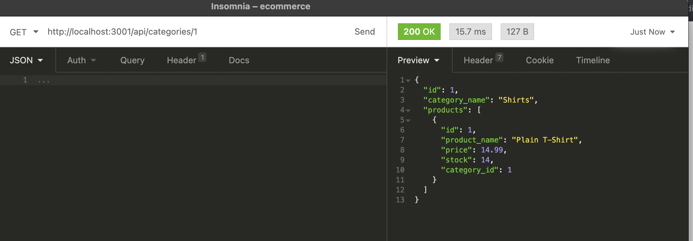
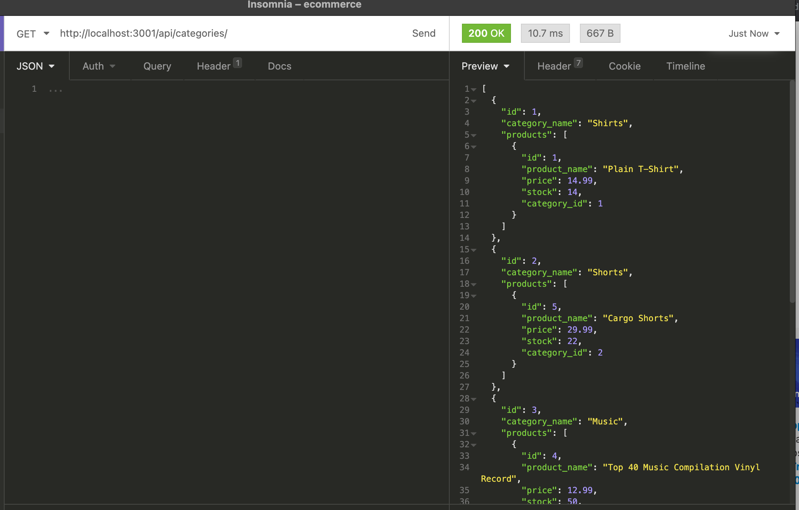

# Object-Relational Mapping (ORM): E-Commerce Back End

## About this Assignment
Internet retail, also known as **e-commerce**, is the largest sector of the electronics industry, generating an estimated $29 trillion in 2019. E-commerce platforms like Shopify and WooCommerce provide a suite of services to businesses of all sizes. My task is to build the back end for an e-commerce site by modifying starter code. I configured a working Express.js API to use Sequelize to interact with a MySQL database. In order for this application to work in your local machine, you will need to install the following dependencies

```
dotenv
express
mysql
mysql2
sequelize
```

## [Walkthough Video](https://drive.google.com/file/d/1zGAwAC4LBWSlzW6q_mhpZlJGXt3xRaTS/view)

## Sample Pictures




